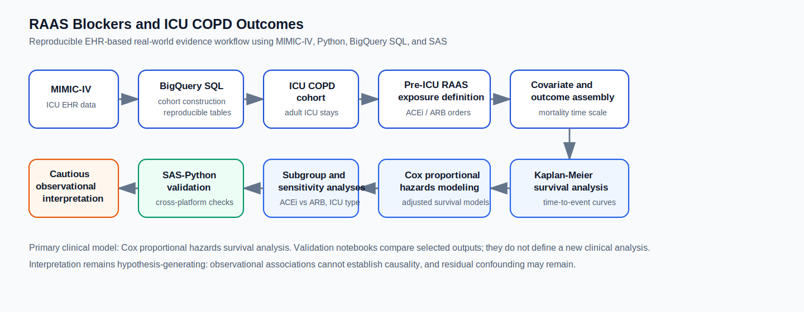
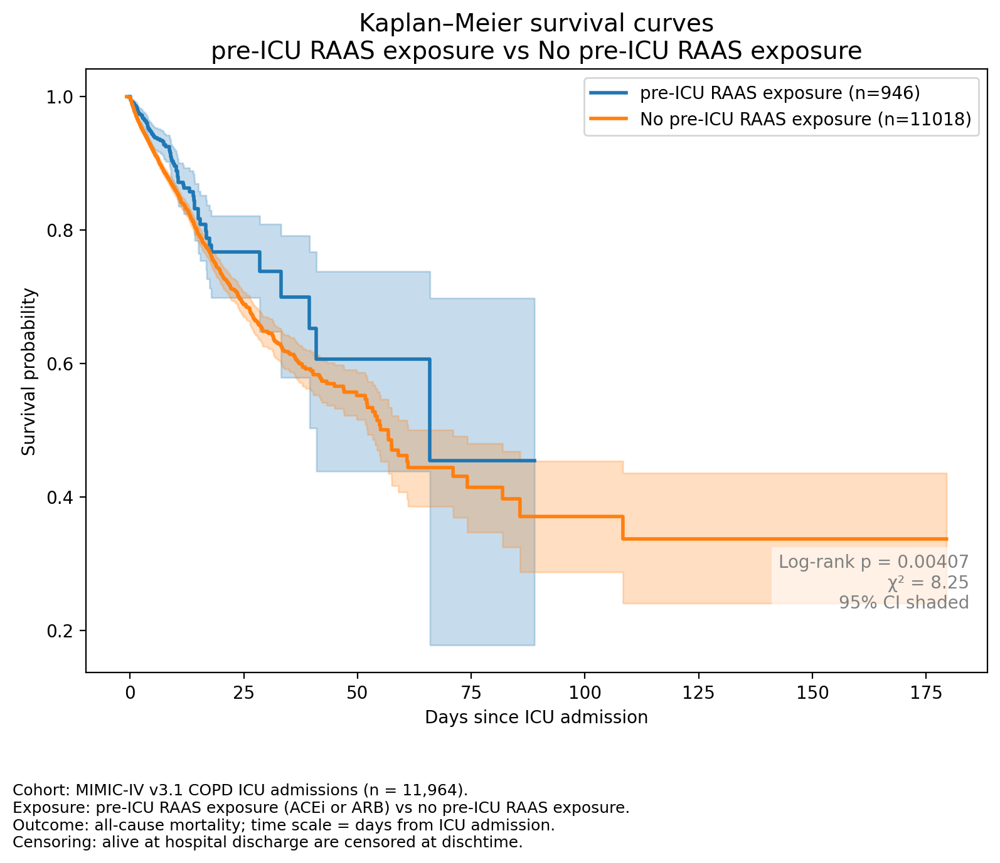
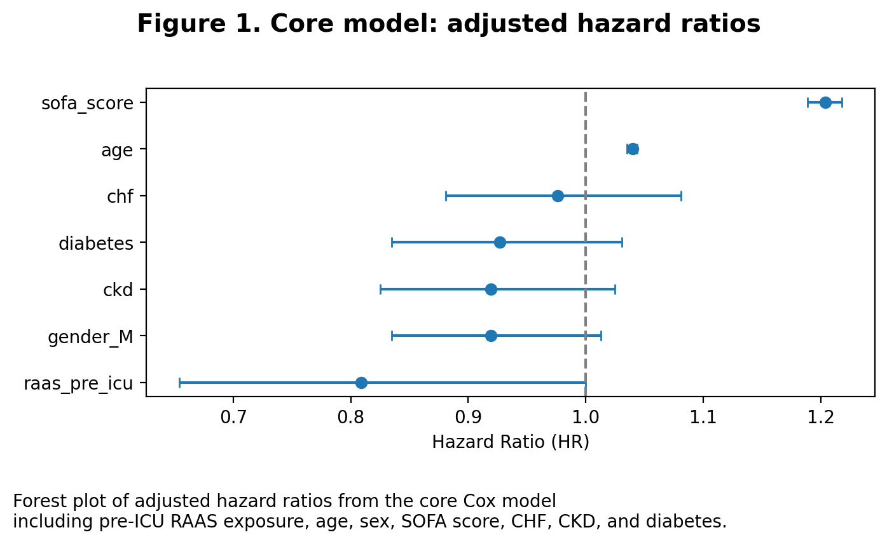

# RAAS Blockers and Clinical Outcomes in COPD ICU Admissions

*A reproducible MIMIC-IV clinical analytics portfolio project*

Makoto Yoshida, PhD<br>
Clinical Data Analytics Portfolio<br>
LinkedIn: https://www.linkedin.com/in/makoto-yoshida/

## Overview

This repository contains an EHR-based retrospective observational cohort study using MIMIC-IV v3.1. It evaluates whether pre-ICU RAAS inhibitor exposure is associated with time-to-in-hospital mortality among ICU patients with COPD.

The primary analysis is Kaplan-Meier survival analysis and Cox proportional hazards modeling. The clinical interpretation remains cautious: this is a hypothesis-generating observational association and cannot establish causality.

## Full Analysis Report

A polished Quarto report is available for readers who want a single, narrative version of the analysis:

- [Quarto clinical analysis report](https://makotoy56.github.io/mimic-iv-copd-raas-analysis/copd_raas_survival_report.html)

The README provides a portfolio-oriented project overview and navigation across the repository. The Quarto report presents the study question, methods, results, figures, interpretation, limitations, and reproducibility notes as a unified analysis narrative. The `docs/` directory provides modular reference documentation and the GitHub Pages HTML report, while `notebooks/` contains the executable analysis workflow.

## What This Demonstrates

- Real-world evidence workflow using ICU EHR data
- Reproducible cohort, exposure, covariate, and outcome construction in BigQuery SQL
- Survival analysis with Kaplan-Meier curves and Cox proportional hazards regression
- ACE inhibitor vs ARB subgroup analysis and extended covariate sensitivity modeling
- SAS-Python reproducibility validation of selected model outputs
- Transparent observational interpretation, including residual confounding limitations

## Workflow



## Why This Project Matters

This project shows how clinical analytics teams can move from raw ICU EHR tables to a reproducible real-world evidence workflow. It emphasizes transparent cohort, exposure, covariate, and outcome definitions; survival analysis for time-to-event outcomes; and cross-platform validation using Python and SAS.

For clinical analytics, RWE, HEOR, and outcomes research teams, the portfolio value is the operational workflow: defensible data definitions, documented modeling decisions, reproducible notebooks, and validation checks that make results easier to review. The findings remain observational and hypothesis-generating, cannot establish causality, and may still be affected by residual confounding.

## Key Findings

- Pre-ICU RAAS inhibitor exposure was associated with lower observed in-hospital mortality in Kaplan-Meier and Cox survival analyses.
- The refined proportional hazards-compliant Cox model estimated HR 0.71 (95% CI 0.58-0.88) for combined pre-ICU RAAS exposure.
- ACE inhibitor monotherapy showed a stronger observed association than ARB monotherapy; ARB estimates were directionally lower-hazard but not statistically significant.
- Extended adjustment, including ICU type and additional severity/case-mix variables, attenuated the association.

See [Results summary](docs/RESULTS_SUMMARY.md) and [Discussion and limitations](docs/DISCUSSION_AND_LIMITATIONS.md) for interpretation details.

## Results Visualizations

Figures shown in the README are generated from the analysis notebooks and saved under `assets/` so that rerunning the notebooks refreshes the displayed results.





## Technical Snapshot

| Area | Details |
| --- | --- |
| Data | MIMIC-IV v3.1 ICU admissions |
| Design | Retrospective observational cohort study |
| Population | Adult ICU patients with COPD |
| Exposure | Pre-ICU inpatient prescription orders for ACE inhibitors or ARBs before or at ICU admission |
| Primary outcome | Time-to-in-hospital mortality from ICU admission to death or discharge |
| Primary model | Cox proportional hazards survival analysis |
| Secondary validation | 04d logistic model for SAS-Python reproducibility comparison only |
| Tools | BigQuery SQL, Python, Jupyter, SAS |

Exposure is based on inpatient medication orders before ICU admission and does not directly capture outpatient chronic use, adherence, dose, or duration.

## Explore The Project

- [01 ICU cohort extraction](notebooks/01_icu_cohort.ipynb) and [short notes](docs/01_icu_cohort_SHORT.md)
- [02 COPD cohort and RAAS exposure](notebooks/02_cohort_and_exposures.ipynb) and [short notes](docs/02_cohort_and_exposures_SHORT.md)
- [03 baseline covariates](notebooks/03a_baseline.ipynb) and [short notes](docs/03a_baseline_SHORT.md); [exposure merge](notebooks/03b_merge_exposures.ipynb) and [short notes](docs/03b_merge_exposures_SHORT.md)
- [04a primary survival analysis](notebooks/04a_outcomes_and_modeling.ipynb) and [short notes](docs/04a_outcomes_and_modeling_SHORT.md)
- [04b ACE inhibitor vs ARB subgroup analysis](notebooks/04b_outcomes_and_modeling_raas_subgroups.ipynb) and [short notes](docs/04b_outcomes_and_modeling_raas_subgroups_SHORT.md)
- [04c extended covariate Cox models](notebooks/04c_extended_covariate_cox_model.ipynb) and [short notes](docs/04c_extended_covariate_cox_model_SHORT.md)
- [04d secondary Python logistic validation model](notebooks/04d_python_logistic_model.ipynb) and [short notes](docs/04d_python_logistic_model_SHORT.md)
- [05 SAS-Python reproducibility validation](notebooks/05_sas_python_validation.ipynb) and [short notes](docs/05_sas_python_validation_SHORT.md)
- [SAS programs](sas/programs/) and [SAS workflow notes](sas/README.md)

## Detailed Documentation

- [Study background](docs/STUDY_BACKGROUND.md): RAAS biology, COPD rationale, and prior literature
- [Methods overview](docs/METHODS_OVERVIEW.md): design, cohort, exposure, outcome, covariates, and analysis plan
- [Results summary](docs/RESULTS_SUMMARY.md): concise findings without causal strengthening
- [Discussion and limitations](docs/DISCUSSION_AND_LIMITATIONS.md): interpretation, residual confounding, and generalizability
- [Validation notes](docs/VALIDATION_NOTES.md): Python/SAS validation scope and reproducibility checks
- [Figure reproducibility](docs/FIGURE_REPRODUCIBILITY.md): README figure export locations and refresh workflow
- [PACE](docs/PACE.md): project planning and execution context

## Reproducibility And Validation

The workflow uses version-controlled notebooks, SQL scripts, and SAS programs. No patient-level data are included in this repository.

`requirements.txt` provides the minimal Python environment for notebooks and validation scripts:

```text
python -m venv .venv
source .venv/bin/activate
pip install -r requirements.txt
```

MIMIC-IV/PhysioNet access, Google Cloud authentication, BigQuery access, and local SAS path configuration must be set up separately.

Validation scope:

- `04d_python_logistic_model.ipynb` fits a secondary Python logistic model only to generate parameters for reproducibility comparison.
- `05_sas_python_validation.ipynb` compares precomputed SAS and Python secondary logistic validation outputs; it is not a new clinical analysis.
- Cox proportional hazards survival modeling remains the primary clinical analysis.
- `scripts/validation_checklist.py` performs lightweight BigQuery table-existence checks only; it does not validate table contents.

## Project Structure

```text
mimic-iv-copd-raas-analysis/
|-- assets/           # Portfolio visuals
|-- docs/             # Study background, methods, results, limitations, validation notes, and Pages HTML
|-- notebooks/        # 01-05 analysis notebooks
|-- reports/          # Quarto report source and render configuration
|-- sas/              # SAS workflow notes and programs
|-- scripts/          # Validation utilities
|-- sql/              # BigQuery SQL for cohort/exposure/outcome construction
`-- README.md
```

## Data Source And Compliance

This project uses MIMIC-IV v3.1, maintained by the MIT Laboratory for Computational Physiology and made available via PhysioNet.

Johnson A., Bulgarelli L., Pollard T., Gow B., Moody B., Horng S., Celi L.A., & Mark R. (2024). *MIMIC-IV (version 3.1)*. PhysioNet. RRID:SCR_007345. https://doi.org/10.13026/kpb9-mt58.

Access was granted after required training and approval under the PhysioNet data use agreement. This repository contains no patient-level data.
